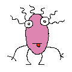

MonsterID
#########

|Packagist| |GitHub| |Gitlab| |Bitbucket|

MonsterID is a method to generate a unique monster image based upon a certain identifier
(IP address, email address, whatever).
It can be used to automatically provide personal avatar images in blog comments or other community services.

|Monster Example|

MonsterID was inspired by a post by `Don Park`_ and the `Combinatoric Critters`_.

Installation
============

Install it with Composer

``composer require 'sandfoxme/monsterid:^1.2'``.

Usage
=====

Function-style
--------------

.. code:: php

   <?php

   // use function is available for PHP >= 5.6, call with full namespace in earlier versions
   use function \SandFox\MonsterID\build_monster;

   $image = build_monster('sandfox@sandfox.me', 150);

   // save it to file
   file_put_contents('avatar.png', $image);

Object-style
------------

.. code:: php

   <?php

   use \SandFox\MonsterID\Monster;

   $monster = new Monster('sandfox@sandfox.me');

   // save it to file
   file_put_contents('avatar.png', $monster->build(150));

   // or output it to browser
   header('Content-type: image/png');
   echo build_monster('sandfox@sandfox.me', $monster->build(150));

License
=======

All graphics were created by `Andreas Gohr`_.
The source code and the graphics are provided under the `MIT License`_.

Adaptation as a composer library for modern PHP
was performed by `Anton "Sand Fox" Smirnov <SandFox_>`_

.. _Don Park:               http://www.docuverse.com/blog/donpark/2007/01/18/visual-security-9-block-ip-identification
.. _Combinatoric Critters:  http://www.levitated.net/bones/walkingFaces/index.html
.. _Andreas Gohr:           http://www.splitbrain.org
.. _MIT License:            https://opensource.org/licenses/MIT
.. _SandFox:                https://sandfox.me/

.. |Packagist|  image:: https://img.shields.io/packagist/v/sandfoxme/monsterid.svg
   :target: https://packagist.org/packages/sandfoxme/monsterid
.. |GitHub|     image:: https://img.shields.io/badge/GitHub-monsterid-informational.svg?logo=github
   :target: https://github.com/sandfoxme/monsterid
.. |Gitlab|     image:: https://img.shields.io/badge/Gitlab-monsterid-informational.svg?logo=gitlab
   :target: https://gitlab.com/sandfox/monsterid
.. |Bitbucket|  image:: https://img.shields.io/badge/Bitbucket-monsterid-informational.svg?logo=bitbucket
   :target: https://bitbucket.org/sandfox/monsterid
